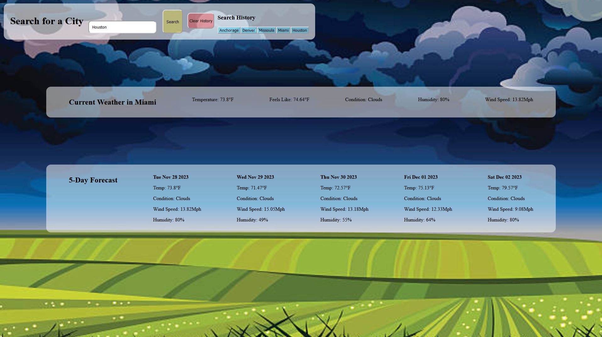
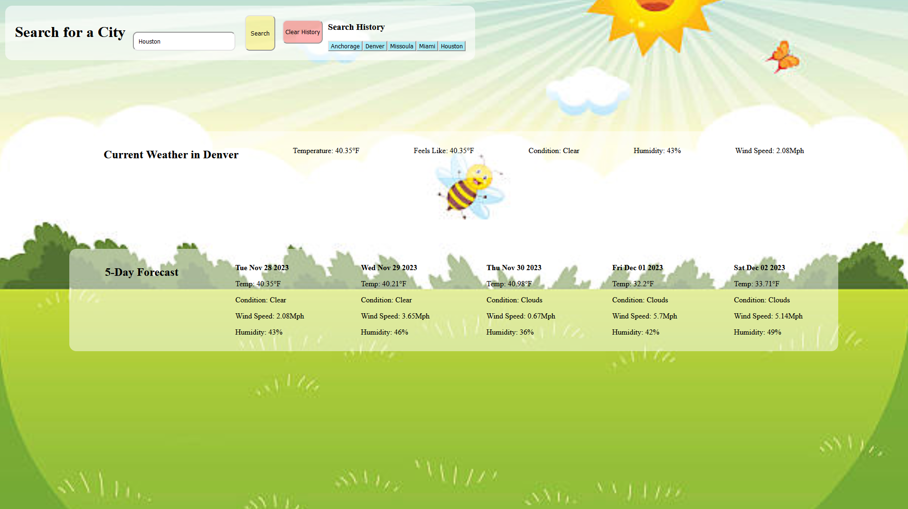

# Shanes-Weather-App

A simple application for checking the weather of any desired city and storing that
data into local storage for future reference.

## Your Task

GIVEN a weather dashboard with form inputs

WHEN I search for a city

THEN I am presented with current and future conditions for that city and that city is added to the search history

WHEN I view current weather conditions for that city

THEN I am presented with the city name, the date, an icon representation of weather conditions, the temperature, the humidity, and the wind speed

WHEN I view future weather conditions for that city

THEN I am presented with a 5-day forecast that displays the date, an icon representation of weather conditions, the temperature, the wind speed, 
and the humidity

WHEN I click on a city in the search history

THEN I am again presented with current and future conditions for that city

## Description

I created a 5-day weather forecast application that pulls from a server-side API and displays as current weather and the future 
5-day forecast for the selected city. Info provided is Current Temp, Feels like Temp, Condition(clear, rain, etc), Humidity, and 
Wind speed in Mph.  5-day provides estimated Temp, Condition, Humidity, and Wind Speed. Searched cities are stored in the header for
convienent retreival in the future. There is a clear history button to reset the site. The background images for the site change
dynamically based on the current weather condition giving a quick visual representation of the current weather.

## Link to completed application & Github repository 

https://github.com/S10skeleton/Shanes-Weather-App

https://s10skeleton.github.io/Shanes-Weather-App/

## Screenshot 

